# CampusOne Delivery Frontend

## Team Members
- Khant Nyi Thu
- Paing Min Thant
- Pyae ZIn Phyo

## Project Description
CampusOne Delivery Frontend is a web application for campus food and shop delivery services. It supports three user roles: customers, vendors, and administrators. Customers can browse vendors, view menus, place orders, and track order status. Vendors can register shops, manage menu items, and handle incoming orders. Administrators can monitor system data and manage users, vendors, and locations.

## Screenshots

### User
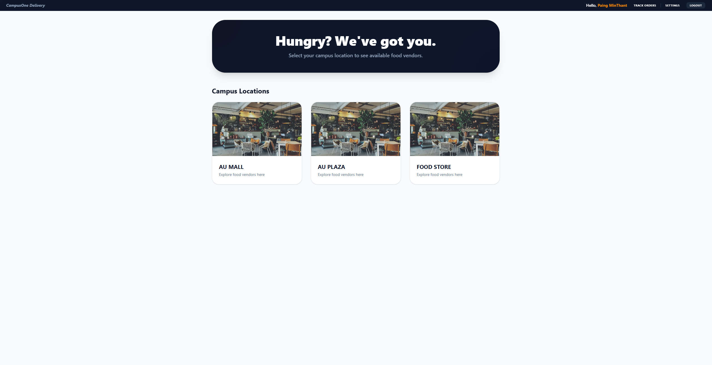
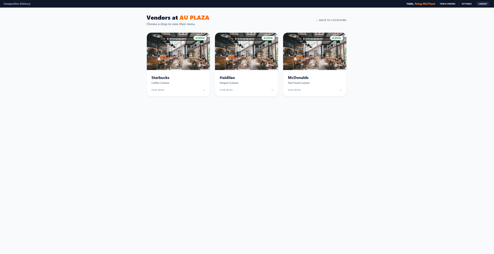
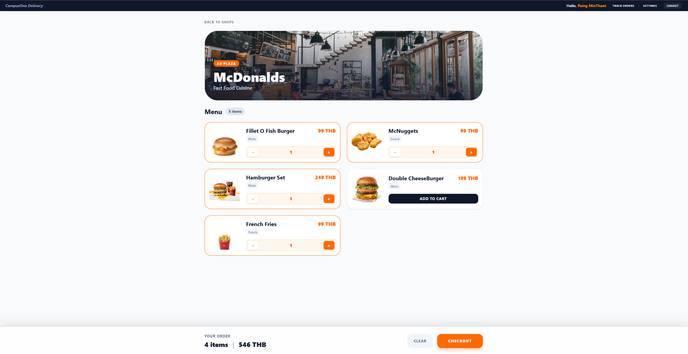
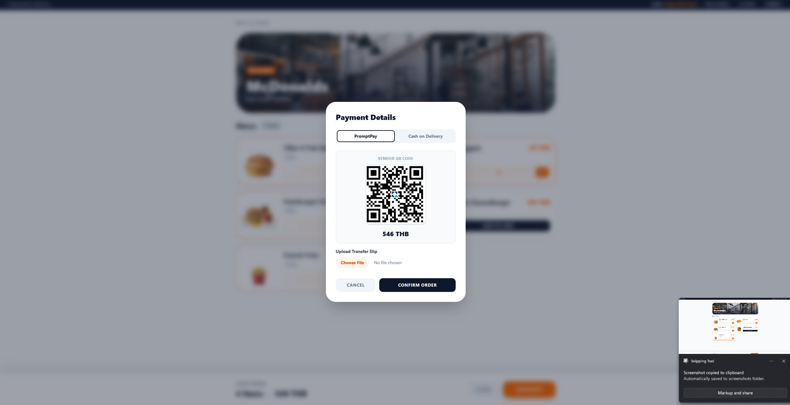
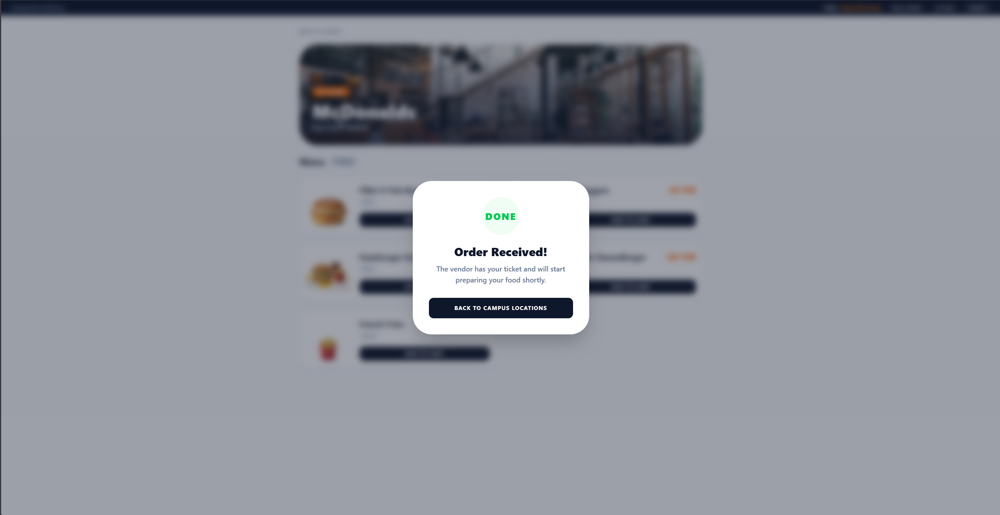

### Vendor
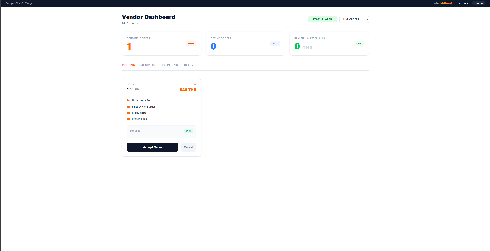
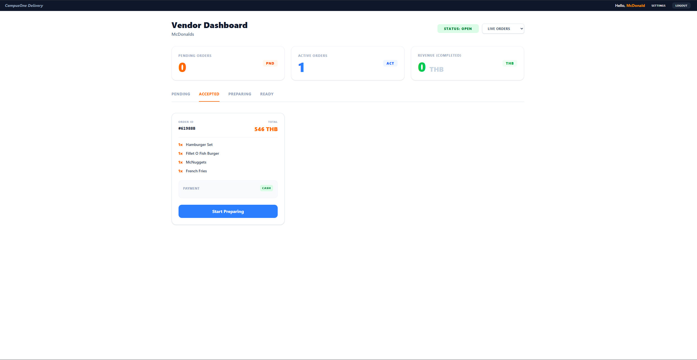
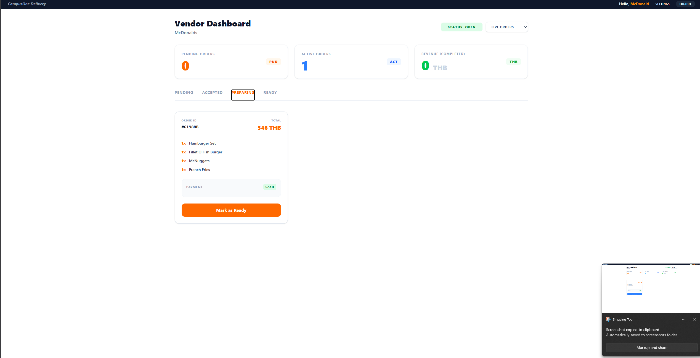

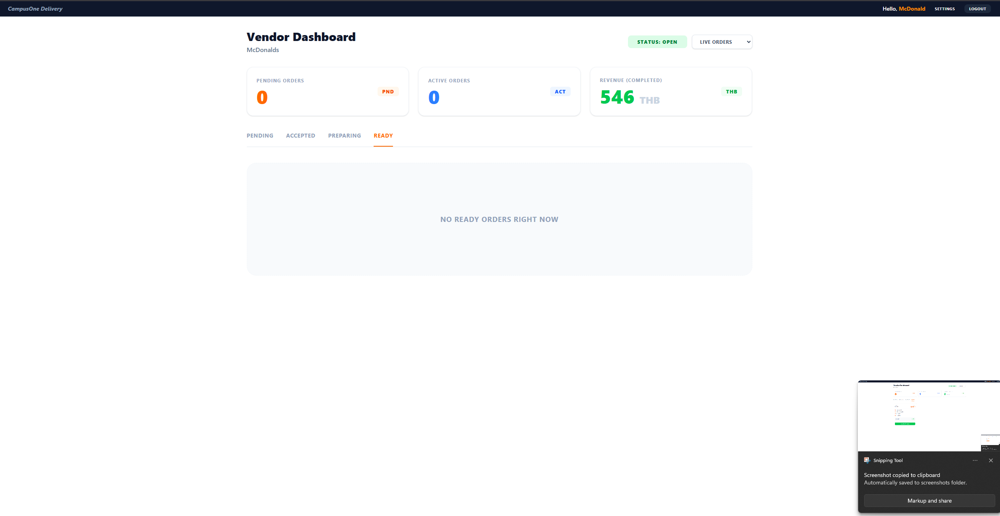

### Admin
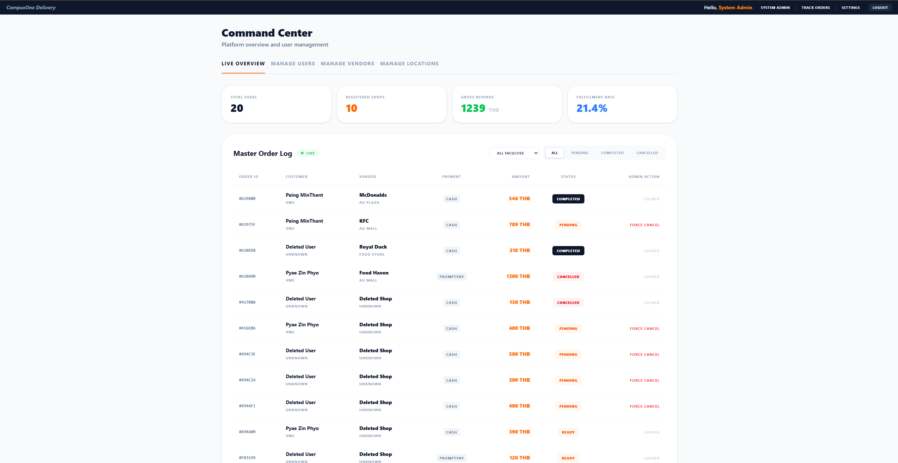
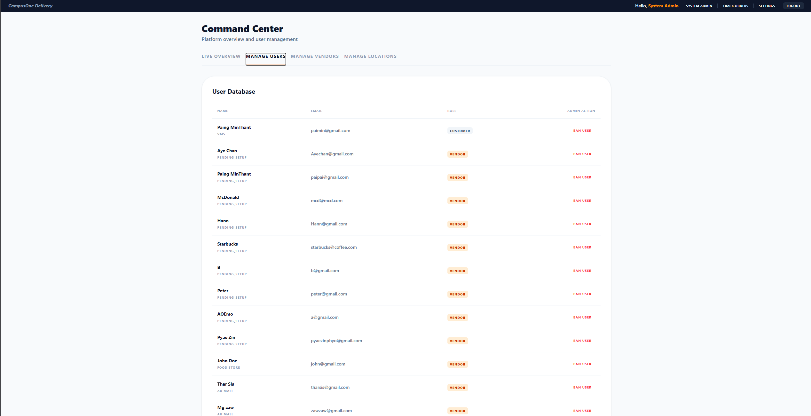
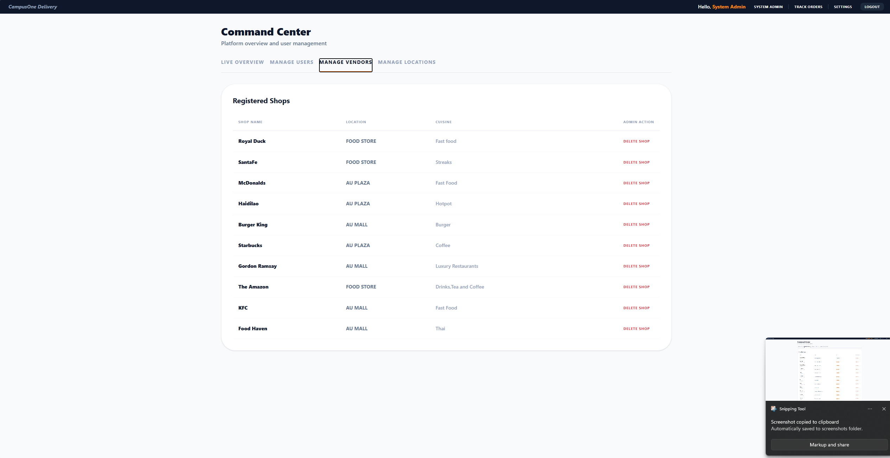
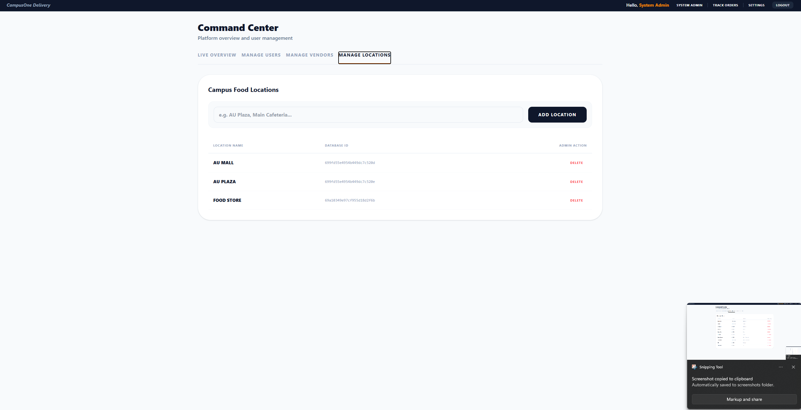

## Full detailed walkthrough will be demonstrated in youtube video.

